# sysmon

**Um painel para todas as suas máquinas Linux — sem servidor, sem banco, sem
nuvem.** Uma janela na sua área de trabalho que fica vermelha quando algum host
esquenta, enche ou cai.



## A dor que ele resolve

Você tem um Proxmox, um servidorzinho de casa, talvez uma VPS. Para saber se
algum está com disco cheio, CPU fervendo ou simplesmente offline, a escolha
costuma ser abrir SSH em cada um — ou montar um Grafana + Prometheus, com banco
de série temporal, um _exporter_ em cada host e um servidor no ar só para isso.

O sysmon é o meio-termo que faltava:

- **No host:** um binário Go estático. Instalar é copiar um arquivo. Sem
  runtime, sem `pip`, sem `exec`, sem root — ele lê `/sys` e `/proc` e serve por
  HTTP, atrás de um token.
- **Na sua máquina:** um arquivo. Abre uma **janela nativa** (e um ícone de
  bandeja) que busca os dados de todos os agentes e mostra tudo junto. O ícone
  muda de cor pelo pior host e **notifica quando algo muda**.

Nada roda "na nuvem": a janela é o servidor. Ela puxa as métricas direto dos
hosts, na sua LAN ou por um túnel (WireGuard/Tailscale). Um autostart, um
processo.

## Como funciona

1. **Instale o agente** em cada host Linux — um `install.sh`, ou o `deploy.sh`
   fazendo N hosts por SSH de uma vez.
2. Cada agente serve **`GET /metrics`** (autenticado por token) com CPU,
   temperatura, RAM, discos, SMART, RAID, thin pool LVM e rede — e guarda o
   histórico dos contadores SMART, que é o que permite dizer se um setor
   realocado é de ontem ou de dois anos atrás.
3. **Abra o cliente** na sua máquina: a **janela nativa + bandeja** (o padrão)
   ou a **tabela no terminal**. Os dois leem os mesmos hosts e **as mesmas
   regras de alerta**, definidas num lugar só.

## Estrutura

| Caminho | Onde roda | O que é |
|---|---|---|
| `cmd/sysmon-agent` | cada host | agente HTTP read-only, binário estático |
| `cmd/sysmon` | sua máquina | o cliente: um binário, sem runtime |
| `internal/metricas` | os dois | **o contrato do fio, definido uma vez só** |
| `internal/coleta` | agente | lê `/proc`, `/sys` e o SMART do smartctl |
| `internal/historico` | agente | série temporal dos contadores SMART |
| `internal/smart` | cliente | as regras de saúde de disco (função pura) |
| `internal/nucleo` | cliente | config, polling e regras de alerta |
| `internal/tela` | cliente | o que aparece — compartilhado pela janela e pelo terminal |
| `internal/janela` | cliente | **janela nativa (Gio), o padrão** |
| `internal/terminal` | cliente | tabela no terminal |
| `internal/bandeja` | Windows | ícone de bandeja em Win32 puro |
| `internal/atualizar` | cliente | troca o próprio binário pela versão nova |
| `linux-agent/install.sh` | cada host | instala, gera token e testa |
| `linux-agent/deploy.sh` | sua máquina | instala em N hosts por SSH e gera o config |
| `linux-agent/sysmon-agent.service` | cada host | unit systemd com hardening + watchdog |
| `linux-agent/sysmon-smart.{sh,service,timer}` | cada host | roda o `smartctl` numa unit isolada |
| `linux-agent/sysmon-thinpool.{service,timer}` | Proxmox | snapshot do thin pool LVM |
| `windows-tray/instalar-autostart.ps1` | Windows | registra no Agendador de Tarefas |

**Um módulo Go só**, com dois binários. Até a v5.0 eram dois módulos e o
contrato do fio existia em duas cópias, com um teste comparando as tags JSON
para que não divergissem em silêncio. Agora os dois lados leem a mesma
definição — que é a única garantia que não depende de alguém lembrar de rodar
nada.

## Instalação nos hosts Linux

### Pacote pronto (sem compilar nada)

Os releases trazem o agente empacotado: binário estático, units e instalador.
Não precisa de Go, Python nem nada além de `curl` no host de destino.

```bash
# no host a ser monitorado
curl -fLO https://github.com/9LEVEL/sysmon/releases/latest/download/sysmon-agent-2.4.0-linux-amd64.tar.gz
tar xzf sysmon-agent-2.4.0-linux-amd64.tar.gz
cd sysmon-agent-2.4.0-linux-amd64
sudo ./install.sh 192.168.0.10          # IP da LAN ou do túnel
```

Confira as somas com o `SHA256SUMS` do release.

> **ARM.** A v5.1.0 deixou de publicar o binário de arm64 — não houve nenhum
> pedido, e cada alvo a mais é um binário para conferir e publicar em todo
> release. Compilar você mesmo continua sendo uma linha
> (`GOOS=linux GOARCH=arm64 go build ./cmd/sysmon-agent`), e voltar a publicar
> é uma linha no `empacotar.sh`. **Abra uma issue** se precisar.

### Qual arquivo do release baixar

| Arquivo | Para que serve |
|---|---|
| `sysmon-windows-<v>.zip` | **Windows** — o executável e os scripts de autostart |
| `sysmon-linux-<v>.tar.gz` | **Linux** — o executável |
| `sysmon-agent-<v>-linux-amd64.tar.gz` | agente, em **cada host monitorado** (x86_64) |
| `sysmon-windows-amd64.exe` · `sysmon-linux-amd64` | só o binário — é o que o auto-update baixa |
| `SHA256SUMS` | conferência |

Repare que são coisas diferentes: o **agente** vai nas máquinas Linux que você
quer monitorar; o **cliente** vai na máquina de onde você olha.

Para gerar os pacotes você mesmo: `make pacote` (roda a suíte de testes antes).
E o **`deploy.sh` faz tudo por SSH** — compila, copia e instala em N hosts, sem
passar por release nenhum.

### Vários hosts de uma vez (recomendado)

Na sua máquina, com Go e acesso SSH por chave aos hosts:

```bash
cd linux-agent
cat > hosts.conf <<'EOF'
# apelido  destino_ssh          ip_de_bind     porta
pve        root@192.168.0.10    192.168.0.10   9109
nas        root@192.168.0.20    192.168.0.20
vps        root@100.90.1.5      100.90.1.5            # IP do Tailscale
EOF

./deploy.sh hosts.conf
```

Ele compila, copia o binário certo para a arquitetura de cada host, instala,
testa e no fim escreve um `hosts.json` (modo 600) com os tokens de todos —
pronto para os dois clientes. É o passo que antes você fazia à mão.

### Um host só

```bash
make agente                    # gera dist/sysmon-agent
cp dist/sysmon-agent linux-agent/bin/
scp -r linux-agent root@192.168.0.10:/tmp/
ssh root@192.168.0.10 '/tmp/linux-agent/install.sh 192.168.0.10'
```

O instalador copia para `/opt/sysmon`, gera o token em `/etc/sysmon/token.env`,
sobe o serviço, ativa o timer do thin pool **se** houver LVM thin, remove o
grupo `www-data` da unit **se** não for Proxmox, e testa. No fim imprime a URL
e o token.

Temperaturas exigem que o kernel exponha os sensores. O agente funciona sem
isso (`cpu_temp` vem `null`), mas para ter o número:

```bash
apt install lm-sensors
sensors-detect          # responda YES; grava os módulos em /etc/modules
sensors
```

Feche a porta para o resto da rede:

```bash
iptables -A INPUT -p tcp --dport 9109 -s <IP_DO_CLIENTE> -j ACCEPT
iptables -A INPUT -p tcp --dport 9109 -j DROP
```

## Adicionar mais hosts depois

São dois passos: instalar o agente no host novo e acrescentá-lo ao config dos
clientes. Nada precisa ser reiniciado nos hosts que já funcionam.

**Com `deploy.sh`** — acrescente a linha ao `hosts.conf` e rode de novo. Ele é
idempotente: nos hosts já instalados o token existente é mantido, e o
`hosts.json` sai regenerado com todo mundo.

```bash
cd linux-agent
echo "novo   root@192.168.0.30   192.168.0.30" >> hosts.conf
./deploy.sh hosts.conf
```

**Na mão** — instale no host novo, anote a URL e o token que o `install.sh`
imprime, e acrescente ao `config.json` dos clientes:

```json
{
  "hosts": [
    {"nome": "pve", "url": "http://192.168.0.10:9109/metrics", "token": "..."},
    {"nome": "nas", "url": "http://192.168.0.20:9109/metrics", "token": "..."},
    {"nome": "novo", "url": "http://192.168.0.30:9109/metrics", "token": "..."}
  ]
}
```

Regras do `nome`: precisa ser único (é a chave em toda a interface) e é o que
aparece na tabela, no menu do tray e nos alertas. Se você omitir, ele é
derivado do host da URL.

Depois de editar, reinicie o tray (menu → **Sair**, e abra de novo) — o
`config.json` é lido uma vez, no arranque. O terminal basta rodar de novo.

Confira antes de mexer no tray:

```bash
sysmon term --config config.json --once
```

## O cliente

Tudo roda a partir de **um executável**, **na sua máquina** — sem servidor,
sem banco, sem runtime instalado. Ele busca os dados direto dos agentes
remotos e mostra tudo numa janela nativa (o diagrama no topo mostra o fluxo).

**Windows:** duplo clique em `sysmon.exe`.
**Linux:** `./sysmon`.

A janela abre na **tela de configuração** se ainda não houver `config.json`:
preencha apelido, url e token de cada host, clique em Testar e salve. Não
precisa editar arquivo nenhum.

| Comando | O que faz |
|---|---|
| `sysmon` | janela nativa (+ bandeja no Windows) |
| `sysmon --oculto` | sobe minimizado na bandeja (autostart) |
| `sysmon term` | tabela no terminal, atualiza sozinha |
| `sysmon term --once` | imprime uma vez e sai (script/cron) |
| `sysmon term --json` | estado bruto em JSON |
| `sysmon term --host pve` | só um host |
| `sysmon local` | os sensores **desta** máquina, sem rede nem token (Linux) |
| `sysmon local --once` | idem, uma vez e sai |
| `sysmon --sem-bandeja` · `--sem-update` | desliga o que o nome diz |

O `--once` sai com código útil para script: **0** tudo bem, **1** há alerta,
**2** há host fora do ar. Dá para escrever `sysmon term --once || avisar`.

O **`local`** serve para conferir a ferramenta antes de instalar agente
nenhum, e para um `sysmon local --once` no cron da própria máquina. Ele usa
exatamente o mesmo coletor que o agente usa — até a v4 era um leitor de
`/proc` escrito de novo no cliente, que divergia a cada campo novo.

> **De Python para Go.** Até a v4 o cliente era um `sysmon` de 54 KB que
> exigia Python instalado — e, com ele, um lançador por sistema só para
> conseguir trocar o arquivo durante a atualização. Da v5 em diante é um
> binário de ~13 MB sem dependência nenhuma. Você troca 13 MB de download por
> nunca mais precisar instalar interpretador, e a atualização passou a ser o
> programa se substituindo sozinho.

### Atualização automática

**Pelo botão.** O **⭳** no cabeçalho procura versão nova; havendo, baixa e o
botão fica **verde**. Clicar de novo troca o binário e reinicia já na versão
nova. Sem ir ao GitHub, sem descompactar nada.

Sozinho, ele também verifica ao iniciar e a cada 6 horas, e avisa no rodapé
quando há versão pronta.

Três barreiras antes de qualquer troca, porque este é o único código do
projeto que pode fazer estrago sério — ele roda como você, na sua máquina:

- **SHA256** conferido contra o `SHA256SUMS` do release;
- **assinatura do arquivo** (`MZ` no Windows, `ELF` no Linux) — pega download
  truncado e, principalmente, página de erro servida com código 200;
- release **sem o binário da sua plataforma** vira erro explícito, não
  tentativa de instalar o de outra.

A troca em si aproveita uma particularidade do Windows: não dá para
**sobrescrever** um executável em uso, mas dá para **renomear**. Então o atual
vira `.old`, o novo assume o nome, o processo novo sobe e o `.old` some no
arranque seguinte. Se o último passo falhar, o anterior volta — ficar sem
binário nenhum é o pior desfecho possível de uma atualização.

Para desligar: `--sem-update`, ou `"horas_entre_updates": 0` no `config.json`.

### A janela

Sem moldura, escura, monoespaçada. No corpo, **nenhum ícone**: a hierarquia e a
severidade saem de tipografia, alinhamento e cor.

```
 sysmon  1 host · 1 alerta

 ▾ MAQUINA     3G de 15G · Ubuntu 26.04 LTS    39C · cpu 5% · ram 21%
     DESEMPENHO
       cpu      8 nucleos · Core i3-12100   ▅▆▁▅▆▁▅▆ ███······    5%
       memoria  3G / 15G                    ▁▁▁▁▁▁▁▁ ██········   21%
       carga    0.83 5m · 0.54 15m                             1.33
     TEMPERATURA
       cpu      critico 100C                ▃▅▂▆▄▃▅▂             39C
```

No **cabeçalho**, à direita, uma fileira de ícones desenhados a vetor — não
dependem de fonte, então aparecem iguais em qualquer sistema: **sempre no topo**
(acende em azul quando ligado), **limiares de alerta**, **escolher o que exibir**
e **hosts**; depois de um separador, **minimizar** e **fechar** (que fica vermelho
ao passar o mouse). Cada ícone diz o que faz no hover. Não há botão para recarregar
os dados: a janela já atualiza sozinha no intervalo, e **F5** força quando você
quiser. O **⭳** é outra coisa — atualiza o *programa*.

**Três colunas com papéis fixos.** O nome nunca é truncado; o detalhe no meio é
quem cede quando você estreita a janela; os números ficam **colados na borda
direita** e acompanham o redimensionamento. A coluna do meio pode ser desligada
em *exibir* — sem ela, o valor encosta na direita e sobra só nome e número.

**A barra de rolagem aparece só quando há o que rolar**, e some quando tudo
cabe na janela.

**No topo, um gráfico animado da CPU da frota.** A cor sai da severidade: fica
âmbar ou vermelho antes de você ler qualquer número. Anda só com a janela na
tela — recolhida na bandeja, o desenho para, para não gastar CPU da máquina que
o programa existe para vigiar. Se a janela ficar curta demais para os dois, ele
se recolhe sozinho e volta quando há espaço: enfeite não espreme a lista. Pode
ser desligado de vez em *exibir*.

#### O gráfico do topo mostra um host, e você escolhe qual

Duas etiquetas no canto do gráfico dizem o que está desenhado ali — **host** e
**medida** — e clicar em cada uma troca. As medidas são **cpu**, **memória** e
**temperatura**, as três que vivem na mesma escala de 0 a 100.

A **altura** é um preset no `☰`, junto com a **margem esquerda** (0, 5, 10 ou
20 px): baixo, médio, alto ou cheio. Em 46 px a curva
diz "está vivo"; em 130 px ela mostra a forma, que é o que importa quando você
está acompanhando um pico. Se o preset escolhido não couber junto com a lista,
o gráfico se recolhe sozinho — enfeite não espreme informação.

Até a v5.1 era a média de CPU da frota. Média de hosts diferentes não mede
coisa nenhuma: dois servidores a 10% e a 90% viram 50%, que não descreve nem um
nem outro. E não havia nada dizendo o que o número era.

#### Clique no host para recolher o bloco

Com quatro hosts a árvore inteira cabe na tela; com dez, não cabe nem perto, e
rolar para comparar dois derrota o propósito de ter tudo visível junto. Clicar
na linha do host recolhe o bloco dele — a seta à esquerda diz o estado, e o
cabeçalho continua visível com o resumo. Fica guardado entre sessões.

#### Os ícones do cabeçalho têm dica

Passe o mouse: aparece o que cada um faz. São oito sem rótulo, e a dica existe
justamente para não virar um enigma novo a cada versão.

#### Ela funciona estreita, encostada na lateral

O uso comum é deixar a janela aberta ocupando uns 2/5 da largura da tela, como
um widget sempre à vista. Nessa largura as colunas se ajustam: o detalhe do
meio é cortado antes de encostar no valor, a barra e o sparkline saem quando
não cabem, e os botões dos diálogos passam para uma segunda linha em vez de se
sobreporem.

O mínimo é 470 × 260. **ESC** fecha qualquer diálogo.

Na tela de hosts, cada host ocupa duas linhas — apelido e url em cima, token e
as ações embaixo. Numa linha só eram cinco caixas lado a lado, e em janela
estreita os campos viravam frestas. A ferramenta é feita para **4 a 10 hosts**;
acima disso ela perde o propósito, e com esse teto altura por host é barata.

#### Cinco degraus de cor, não três

Sair de 3% para 30% de CPU é a variação que interessa no dia a dia, e com
apenas ok/aviso/crítico os dois eram a mesma cor:

| Faixa | Cor | Leitura |
|---|---|---|
| < 20% | cinza apagado | ocioso, a linha recua |
| 20–50% | branco | trabalhando |
| 50% até o aviso | ciano | notável |
| ≥ aviso | âmbar | atenção |
| ≥ crítico | vermelho | agora |

Âmbar e vermelho continuam significando **alerta** — por isso a faixa
intermediária usa ciano, e não um amarelo mais claro que competiria com eles.

#### Sparkline

`▅▆▁▅▆▁▅▆` ao lado da barra mostra os últimos ciclos. A barra responde "quanto
agora"; o sparkline responde **"está subindo ou é o normal dele?"** — que é o
que a barra sozinha não conta.

A escala é automática **com piso de amplitude**: oscilar entre 3,0% e 3,2%
continua parecendo o que é (linha reta), mas subir de 3% para 30% preenche o
desenho. Escala fixa 0–100 achataria a variação útil; autoescala pura
transformaria ruído em drama.

**Arrasta pelo cabeçalho**, redimensiona pelo canto inferior direito. O `▲`
prende sobre as outras janelas. Botão direito no topo abre o menu — inclusive
para trazer a moldura do sistema de volta.

**Não depende de nada.** A janela é desenhada pelo próprio programa: não há
toolkit do sistema envolvido, e por isso ela sai idêntica no Windows e no
Linux.

O `⌂` abre a configuração de hosts, com botão **Testar**.

### Aceitar um alerta

Nem todo alerta tem conserto. "89 de 206 desligamentos foram inesperados" é um
fato do hardware: verdadeiro, útil da primeira vez, e depois disso apenas
repetido a cada 3 segundos para sempre. Alerta que não pode ser resolvido nem
aceito acaba ignorado — e, a partir daí, **todos** são.

O ícone de **sino** abre *alertas e notificações*: a lista do que está
alertando agora, com um **ACEITAR** em cada linha.

Aceitar esconde o alerta do rodapé e **devolve a cor ao normal**. Não é
silenciar para sempre — o que fica guardado é o **valor** que disparou:

```
aceito:  89 de 206 desligamentos inesperados
90 de 207  →  volta a alertar
```

Vale para qualquer coisa com valor estável: contadores SMART, RAID degradado,
disco cheio, thin pool. Um RAID em `[U_]` aceito volta a gritar em `[__]`.

**Exceto** CPU, RAM, temperatura e pressão PSI. Esses sobem e descem sozinhos:
congelar "CPU em 82%" seria congelar um número que já mudou no ciclo seguinte.
Para eles a resposta certa é o **limiar**, logo abaixo. A tela mostra a linha,
sem botão, dizendo isso.

O que foi aceito não fica invisível: o ícone acende, a dica dele conta quantos
são e o rodapé mostra "3 alertas aceitos". Silêncio precisa ser visível, senão
vira esquecimento.

Fica no `config.json`, na chave `reconhecidos` — na raiz, e não dentro de
`alertas`: alertas são a regra, aceitação é a exceção a ela.

### Limiares de alerta

O `!` abre onde cada medida vira **aviso** (âmbar) e **crítico** (vermelho):
temperatura da CPU, temperatura de disco, memória, filesystem, inodes, thin
pool, desgaste do SSD e pressão PSI. `PADRAO` volta tudo ao original.

A temperatura da CPU é configurada como **fração do crítico que o próprio
sensor reporta** — `0.75` significa aviso a 75% do limite do chip. É o que faz
o mesmo número servir para hardwares diferentes; o par fixo em °C só entra
quando o sensor não informa o crítico.

Na mesma tela ficam os **filesystems ignorados**, um por linha. O padrão já traz
`/boot` e `/boot/efi`: são partições de tamanho fixo cujo percentual não diz
nada útil — `/boot` enche de kernel antigo e a ESP vive quase cheia por
natureza. Alertar nelas ensina a ignorar alerta.

O filtro vale para a janela e o terminal, e também para o alerta.

### Escolher o que aparece

O `☰` abre a lista de tudo que a ferramenta coleta, agrupado por seção, com
uma caixa para cada campo:

```
☑ RESUMO  na linha do host        ☑ TEMPERATURA
  ☑ temperatura da cpu              ☑ cpu
  ☑ uso de cpu                      ☑ demais sensores do hardware
  ☑ uso de memoria em %           ☑ DISCOS
  ☑ memoria usada em GB             ☑ modelo, temperatura, desgaste, SMART
  ☑ modelo do processador         ☑ ARMAZENAMENTO
  ☑ sistema operacional             ☑ filesystems montados
☑ DESEMPENHO                        ☑ thin pool LVM (Proxmox)
  ☑ uso de cpu                    ☑ REDE
  ☑ memoria                         ☑ interfaces ativas
  ☑ swap
  ☑ carga (load average)
  ☑ tempo no ar
```

A lista mostra **tudo**, mesmo o que você desmarcou — ela serve também de
inventário do que está sendo coletado. Desmarcar uma seção esconde o bloco
inteiro.

O **modelo do processador** aparece na linha do host, ao lado da memória e do
sistema — é identidade da máquina, e não uma medida que muda. Numa janela
estreita ele disputa espaço com os outros dois: desmarque o que não usa.

**Esconder não silencia alerta.** Se você tirar o thin pool da tela e ele
encher, o aviso continua aparecendo no rodapé. Preferência de exibição não
deve virar um jeito silencioso de perder problema — há teste garantindo isso.

A escolha fica em `%APPDATA%\sysmon\janela-tk.json`, junto de tamanho e
posição. O arquivo guarda o que está **escondido**, não o que está visível:
assim um campo novo numa versão futura aparece por padrão, em vez de nascer
oculto para quem já tinha preferência salva.

### Dashboard no terminal

```
sysmon  3 host(s)  1 alerta(s)                                    14:32:05

HOST       CPU    TEMP   RAM    SWAP   DISCO             LOAD              REDE               PSI-IO  UP
pve        12%    47C    38%    2%     / 62%             0.40 0.30 0.20    v1.2M/s ^340K/s    0%      12d3h
nas        4%     39C    22%    --     /tank 91%         0.10 0.00 0.00    v12K/s ^8K/s       3%      45d0h
vps        offline: sem conexao (timed out)

! nas: disco /tank em 91%
```

A tabela descarta colunas conforme o terminal estreita. `--once` e `--host`
saem com código 1 quando há host crítico ou offline, então dá para usar em
cron ou health check.

### É um app de bandeja

No Windows o sysmon se comporta como qualquer app de bandeja:

- **fechar a janela não encerra o programa**: ele fica no ícone da bandeja, e
  a janela reabre pelo ícone ou pelo atalho
- **Sair** no menu da bandeja é o que encerra de verdade
- o ícone muda de cor conforme o pior host, e um balão avisa quando a
  severidade **sobe** — a cada coleta seria ruído, e "voltou ao normal"
  interromperia sem pedir ação

A bandeja é feita em Win32 puro, sem biblioteca: o ícone é gerado em tempo de
execução, porque a forma é sempre a mesma e só a cor muda.

**No Linux não há bandeja, e é decisão.** O mecanismo varia entre ambientes de
desktop — StatusNotifierItem por DBus nos novos, XEmbed nos antigos — e
nenhum está em toda parte. Uma implementação pela metade seria pior que
nenhuma: o programa pareceria ter sumido ao fechar a janela. Ali, fechar
encerra.
Sem eles, a janela funciona igual — só não há ícone na bandeja.

### Bandeja

Opcional. Sem ela a janela sobe normalmente e o motivo aparece no terminal.

O ícone mostra a temperatura do **host mais quente**, colorido pelo **pior
host**: verde abaixo de 75% do crítico do sensor, amarelo entre 75% e 90%,
vermelho acima, cinza se algum host está offline. Um ponto vermelho no canto
acende para qualquer alerta.

Ao lado da janela nativa o menu é enxuto: **Mostrar janela**, **Sempre no
topo**, atualizar, sair. O overlay do tkinter seria redundante com a janela —
para tê-lo, use `sysmon tray`, que traz o modo antigo com submenu por host,
modo compacto e cliques atravessando.

Autostart:

```powershell
powershell -ExecutionPolicy Bypass -File instalar-autostart.ps1
```

Ele tenta o **Agendador de Tarefas** e, se não houver permissão de
administrador, cai na **pasta Inicializar** — que não exige nada. Os dois
funcionam; o Agendador dá a mais o reinício automático se o processo cair.

Seja qual for o caminho, **o outro é removido**: se os dois ficassem ativos,
duas instâncias subiriam no logon e uma morreria disputando a porta. O script
avisa se detectar os dois.

Para forçar um deles:

```powershell
... -Agendador      # exige admin; falha em vez de cair no outro
... -Inicializar    # nem tenta o Agendador
```

No login o sysmon sobe **minimizado na bandeja**, após 20s de espera (para a
rede estabilizar). Clique no ícone da bandeja, ou no atalho da área de
trabalho, para abrir.

Abrir uma segunda vez com o sysmon já rodando **traz a janela existente para a
frente** em vez de tentar subir de novo — vale para o duplo clique no atalho e
para autostart duplicado.

Remover: `desinstalar-autostart.ps1` (limpa os dois caminhos).

## Configuração dos clientes

Os dois clientes leem o mesmo arquivo, e **o arquivo manda**. Nada do ambiente
sobrescreve um valor presente no `config.json` — o ambiente só preenche o que o
arquivo não definiu.

Isso é deliberado. Variável de ambiente é invisível no dia a dia: um
`SYSMON_URL` esquecido de um teste antigo sequestraria a configuração inteira
sem deixar pista de por que o cliente está olhando para o host errado.

| Variável | Quando é usada |
|---|---|
| `SYSMON_CONFIG` | sempre — define **qual** arquivo carregar |
| `SYSMON_TOKEN_<NOME>` | só se aquele host não tiver `token` no arquivo |
| `SYSMON_URL` + `SYSMON_TOKEN` | só se o arquivo não definir host nenhum |
| `SYSMON_NOME` | nome do host acima (padrão: derivado da URL) |

No `<NOME>`, tudo que não for letra ou dígito vira `_` e o resto vira
maiúscula: o host `pve-01.lan` responde a `SYSMON_TOKEN_PVE_01_LAN`. Nome de
variável não aceita hífen nem ponto em nenhum dos dois sistemas.

O uso prático do `SYSMON_TOKEN_<NOME>` é manter token fora do JSON: omita o
campo `"token"` no arquivo e ponha o segredo no ambiente.

### Rodar sem arquivo nenhum

Quando não há `config.json`, `SYSMON_URL` + `SYSMON_TOKEN` bastam para um host
avulso — útil para checar um agente sem configurar nada:

```bash
SYSMON_URL=http://192.168.0.10:9109/metrics SYSMON_TOKEN=... \
  sysmon term --once
```

### No Windows

`setx` grava permanentemente, mas **só vale para processos abertos depois** —
o PowerShell onde você rodou continua sem a variável:

```powershell
setx SYSMON_TOKEN_PVE "cole-o-token-aqui"
$env:SYSMON_TOKEN_PVE = "cole-o-token-aqui"      # sessão atual também

[Environment]::GetEnvironmentVariable("SYSMON_TOKEN_PVE", "User")   # conferir
```

`setx` sozinho grava em `HKCU\Environment` (só o seu usuário); com `/M` vai
para o sistema todo e exige prompt como administrador. Valores acima de 1024
caracteres são truncados.

A tarefa agendada do autostart herda o ambiente do usuário no logon, então o
`setx` vale também para o tray iniciado automaticamente. Para apagar:

```powershell
Remove-ItemProperty -Path HKCU:\Environment -Name SYSMON_TOKEN_PVE -ErrorAction SilentlyContinue
```

Para trocar de host ou de token no dia a dia, edite o `config.json` — é o
caminho previsível, e o que a interface toda reflete.

## O que dispara alerta

Definido num lugar só, em `internal/nucleo.Avaliar()` — a janela, o terminal e
a bandeja não podem divergir sobre o que é problema.

| Condição | Aviso | Crítico |
|---|---|---|
| Temperatura da CPU | 75% do `crit` do sensor | 90% do `crit` |
| Temperatura de disco | 60 °C | 70 °C |
| Disco (bytes ou inodes) | 80% / 90% | 90% / 97% |
| Thin pool LVM (data e metadata) | 80% | 90% |
| RAM | 90% | 97% |
| Pressão PSI (`some_avg60`) | 40% | 70% |
| RAID mdadm degradado | — | sempre |
| Coleta parada no agente | > 4× o intervalo | — |
| Host inalcançável | — | offline |
| Saúde de disco (SMART) | ver a seção abaixo | |

Todos configuráveis pelo `!` na janela, ou pela chave `alertas` do
`config.json`. `/boot` e `/boot/efi` são ignorados por padrão.

Os limiares de temperatura saem do `crit` que o **próprio sensor** reporta, e
não de um número fixo: assim o mesmo config serve para hosts com hardware
diferente.

## Saúde de disco (SMART)

Um SSD ou HD não avisa que vai morrer com um campo dizendo isso. Ele expõe umas
trinta contagens, e a maioria das ferramentas ou repassa a tabela crua — que
ninguém lê — ou reduz tudo a um `PASSED` que só fica `FAILED` quando não há
mais o que fazer.

O `internal/smart` implementa uma especificação de limiares construída sobre
cinco princípios, e cada regra sai de um deles:

1. **Nome, nunca ID.** Atributo de ID 165 a 179 é *vendor-specific*: o mesmo
   170 é `Grown_Bad_Blocks` num WD e `Available Reserved Space` num Intel.
   Casar por número é bug de correção garantido. A chave é o **nome** que o
   `smartctl` resolve pela drivedb dele — e nome fora do catálogo **não vira
   palpite**, é ignorado.
2. **Métrica relativa vence absoluta.** "4 blocos ruins" não quer dizer nada
   sozinho: 4 com 98% de reserva intacta é ruído, 4 com 10% é urgente.
3. **Taxa vence valor absoluto.** 200 setores parados há um ano é um disco
   velho que funciona; 0 → 12 numa semana é um disco morrendo. É por isso que
   o agente guarda histórico (abaixo).
4. **O limiar do fabricante é autoridade.** `VALUE <= THRESH` é falha
   declarada pelo próprio drive, e não há interpretação nossa por cima disso.
5. **Ausência de alerta não é atestado de saúde.** Entre 23% e 36% dos discos
   que falharam não tinham indicador SMART nenhum (Google 2007, Backblaze).
   Por isso a ferramenta **nunca diz "disco saudável"** — diz "sem indicadores
   de falha".

### Três categorias, porque pedem três ações diferentes

| Categoria | O que significa | O que fazer |
|---|---|---|
| **dispositivo** | a mídia está se degradando | trocar o disco |
| **interconexão** | erro de CRC no barramento | trocar o **cabo** ou a porta |
| **host** | desligamentos sujos demais | olhar a **energia** (nobreak) |

Quem mistura as três troca mídia boa e recomeça o ciclo com o mesmo problema —
um cabo SATA ruim produz sintoma em atributo de disco. Por isso o alerta diz
`disco sda (cabo/porta): ...`, e não "troque o disco".

Há também dois **CRÍTICO** distintos: um setor pendente é *aja hoje*; 96% de
vida consumida é *planeje a troca*.

### O histórico, que é o que torna o princípio 3 possível

O `smartctl` só responde sobre o presente. Distinguir "parado" de "crescendo"
exige lembrar do passado, então o **agente** guarda uma série temporal por
`serial` (nunca por `sda`, que vira `sdb` quando alguém troca a ordem dos
cabos) em `/var/lib/sysmon/`, via `StateDirectory=` do systemd.

Fica no agente, e não no cliente, porque o agente é quem tem continuidade: um
histórico que só avança quando alguém está com a janela aberta não serve para
detectar degradação.

A série é densa onde importa e rala no resto — uma amostra por hora nas
últimas 48 h, uma por dia depois disso, 180 dias de retenção. São ~230 pontos
por disco. Contador que **diminui** reinicia a série: contagem SMART só cresce,
e ter caído significa que aquele serial não conta mais a mesma história.

Enquanto não houver histórico suficiente, a regra de taxa fica em **"sem
dados"** — que é diferente de dizer que está tudo bem.

### Ajustando

Tudo isso é configurável pela chave `alertas.smart` do `config.json`, com a
mesma forma da especificação. A herança é **campo a campo**: escrever

```json
{"alertas": {"smart": {"temperature": {"ssd": {"warn": 55}}}}}
```

muda um número e mantém todo o resto do padrão — inclusive os limiares de HDD.

Sem o `smartmontools` instalado no host, o campo vem vazio e o resto funciona.
E disco atrás de controlador RAID, onde o `smartctl` responde mas não alcança
a mídia, vira um estado próprio (**"coleta falhou — saúde desconhecida"**), e
não um disco eternamente sem alerta.

## Endpoints

```
GET /metrics   -> telemetria completa (exige token)
GET /health    -> saúde do coletor    (sem auth, para healthcheck)
```

Autenticação por `Authorization: Bearer <token>` ou `?token=<token>`.

```bash
curl -H "Authorization: Bearer $TOKEN" http://192.168.0.10:9109/metrics | jq
```

Campos: `cpu_temp`, `cpu_crit`, `cpu_percent`, `cpu_modelo`, `temps[]`,
`fans{}`, `load[]`, `mem{}`, `pressure{}`, `discos[]`, `blocos[]`, `net[]`,
`raid[]`, `thinpools[]`, `guests{}`, `so{}`, `uptime_s`, `extras{}`,
`idade_s`, `intervalo_s`, `coletor_falhas`.

`discos[]` são os **filesystems montados** (quanto está cheio). `blocos[]` são
os **discos físicos**: modelo, capacidade, tipo (`nvme`/`ssd`/`hdd`),
temperatura, taxa de leitura/escrita, ocupação e, quando o `smartctl` está
instalado, `smart` com vida consumida, horas ligado e setores realocados.

Temperatura por disco vem do sysfs: NVMe funciona direto, SATA exige o módulo
`drivetemp` — o instalador carrega e persiste automaticamente quando o kernel
suporta.

`idade_s` é a idade do dado servido. Se crescer muito além de `intervalo_s`, o
agente está vivo mas parou de coletar — o `/health` devolve 503 nesse caso, e
o watchdog do systemd reinicia o serviço sozinho.

### Estendendo sem tocar no agente

Qualquer coisa que precise de root ou de executar um binário (`lvs`, `zpool`,
`smartctl`, `systemctl`) roda numa unit isolada e deposita JSON em
`/run/sysmon/<nome>.json`. O agente lê o diretório e publica o conteúdo em
`extras.<nome>`, carimbado com `_idade_s`, sem interpretar nada. O processo
exposto à rede continua sem privilégio e sem `exec`.

O `sysmon-thinpool.timer` é o exemplo que já vem pronto.

## Desenvolvimento

```bash
make teste     # vet, gofmt e testes de tudo (o agente também com -race)
make versao    # confere se todo lugar declara a mesma versão
make agente    # compila o agente para esta arquitetura
make cliente   # compila o cliente para Windows e Linux
make pacote    # gera os pacotes de distribuição em dist/
```

A coleta tem testes com um `/sys` e `/proc` falsos em diretório temporário, o
que permite exercitar hardware que a máquina de desenvolvimento não tem (AMD,
RAID degradado, kernel sem PSI, disco com setor pendente).

As regras de `internal/smart` são **função pura** sobre uma leitura já
normalizada: não dependem de rede, arquivo nem relógio, e por isso a
especificação inteira é testável sem disco nenhum.

## Segurança

Leia [docs/seguranca.md](docs/seguranca.md) antes de expor qualquer porta.
Resumo: read-only, sem `subprocess`, sem root, com hardening de systemd, e
**não deve ser exposto à internet** — o HTTP é puro e o token viaja em texto
claro. Para acesso remoto use WireGuard ou Tailscale e faça bind na interface
do túnel.

## Vindo da v1

- O agente Python virou binário Go. `install.sh` agora precisa do binário ao
  lado (`make agente` na sua máquina), ou compila sozinho se houver Go no host.
- O `config.json` antigo, com `url` e `token` na raiz, **continua funcionando**
  como host único.
- O JSON de `/metrics` manteve todos os campos da v1 e ganhou novos.
- `--mounts` deixou de ter `/ /var/lib/vz` fixo: os pontos de montagem são
  descobertos do `/proc/mounts`. Passe `--mounts` para fixar manualmente.

## Solução de problemas

Consulte [docs/troubleshooting.md](docs/troubleshooting.md).

## Licença

MIT.
